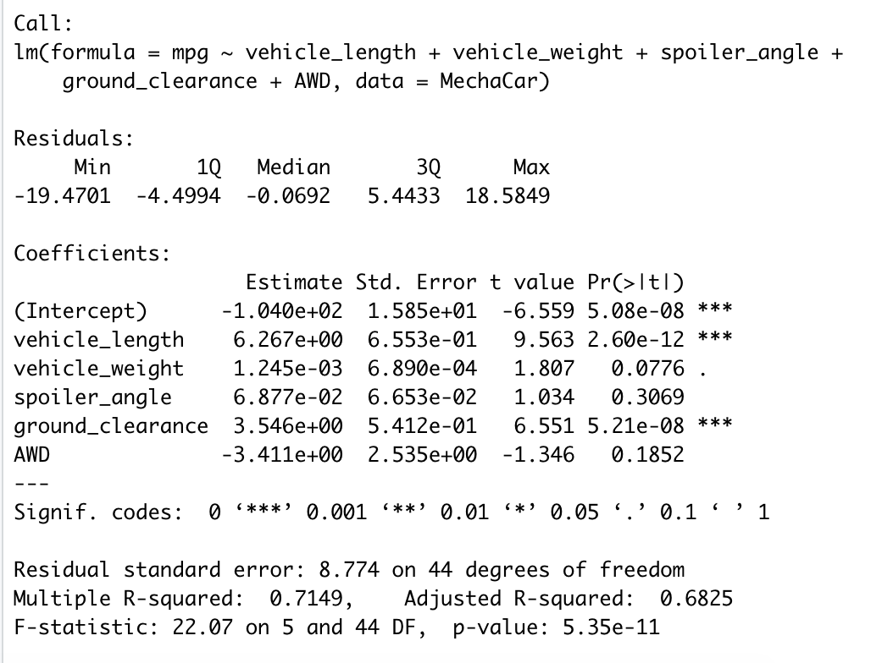
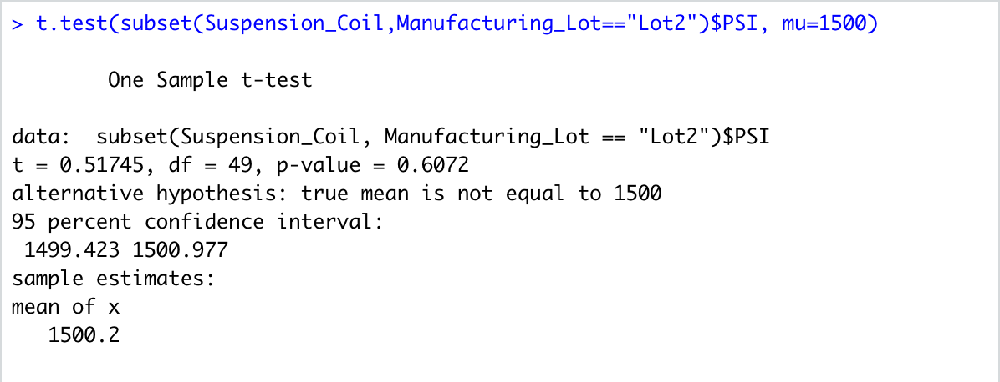

# MechaCar_Statistical_Analysis

## Linear Regression to Predict MPG

## Total Summary

## Lot Summary

## T-Tests on Suspension Coils

## Study Design: MechaCar vs Competition
A statistical study that can quantify how the MechaCar performs against the competition.

Metrics:

- Miles per gallon
- Horse Power
- Transmission Type
- Highway fuel efficiency

Hypothesis:

Null Hypothesis (Ho): MechaCar's performance is based on its transmission type.
Alternative Hypothesis (Ha): MechaCar's performance is not based on its transmission type.

What statistical test would you use to test the hypothesis? And why?

I would use Two Sample T-tests to test the hypothesis.

What data is needed to run the statistical test?

The Data needed to run the statistical test would be the MechaCar and the competition's data.
